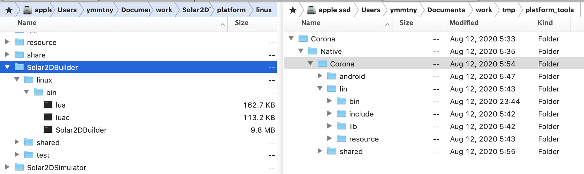

# CMAKE

* CMakeLists.txt
	* CMakeLists.lua
		liblua.a is built but not used
		
		> each project of simulator, builder, player compiles lua by itself

	* CMakeLists.car

		simulator and builder archive lua files into resoruce.car

		> car is exectued from simulator and builder. Mac simulator uses car compiled in OSX and Linux simulator uses car compiled in Linux

	* CMakeLists.console
 
	* CMakeLists.simulator

		plays a user project

		* -DRtt_LUA_COMPILER
		* -DRtt_SIMULATOR
		* Resources

			builds an app with template_player

	* CMakeLists.template_player

		player and widtes pngs

		* -DRtt_LUA_COMPILER

		* 	template_arm.tgz

		> mv $(ProjectName) template_x64 && tar -czf template_x64.tgz template_x64

		Mac simualtor uses the template to build a linux app

		```
		cp Solar2DTemplate template_arm && tar -czf template_arm.tgz template_arm
		mv template_arm.tgz ../../Solar2DSimulator/Resources/templates/template_arm.tgz
		rm template_arm
		```

	* CMakeLists.builder (CMakeLists.template_builder is same)

		builds an app in command line without simulator

		* -DRtt_LUA_COMPILER
		* -DRtt_SIMULATOR
		* -DCORONABUILDER_LINUX

	* (TODO) plat-form_tools
	
		platform_tools.tgz == Solar2DBuilder

		> platform_tools.tgz is extracted with install.sh to ~/.local/share/

		* linux/bin
			* lua/luac
				* from external/lua-5.1.3
					* make linux
					* make install INSTALL_TOP=$(pwd)/../../bin/linux/bin
						* sudo apt-get install libreadline-dev 
			* Solar2DBuilder

		* shared
			* bin/*.lua
				* from bin
				* from bin/shared
			* include		
				* from librtt/Corona/*.h
				* from Products/Debug/usr/local/include
			* resouce
				* from platfrom/resources

		```

		```

		


	* (TODO)CNakeLists.plugin-source-zip

		zip plugin 

		* https://github.com/coronalabs/plugins-source-zip
		* https://github.com/DannyGlover/plugins-source-zip 
			* linux
		

	* (TODO)CNakeLists.plugin-TinyFileDialogs-Plugin

---
## Binaries & Resouces

packages
* amd64
* arm64

content

* Solar2DConsole
* Solar2DSimulator
* Resources
	* bin
		* car
	* linux
		* Linux_Plugin_Template.tgz
		* template_x64.tgz
		* platform_tools.tgz

		> these two exist in the coronalabs repo. Solar2DTux uses template_x64.tgz that is template_player

		* linuxtemplate.tar.gz 
		* raspbiantemplate.tar.gz

		> Simulator on Mac uses the two tar.gz above not template_x64.tgz
---
## install.sh 

* cp -rf Solar2DBuilder ~/.local/share/Corona/Native/Corona/lin/bin/
* tar -xzf Resources/platform_tools.tgz -C ~/.local/share/


> platform_tools contains the resouces of Corona > Native

* plaftorm_tools.tgz
	* Corona/Native/android
	* Corona/Native/lin/bin
		* lua
		* lua64
		* luac
		* luac64
	* Corona/Native/shared
		* bin/**/*.lua
		* include
			* Corona
			* lua
		* resource
			* Corona3rdPartyLicenses.txt
			* CoronaPListSupport.lua
			* CoronaSDK3rdPartyLicenses.txt
			* dkjson.lua
			* json.lua			


OPT_LOCATION=/opt/Solar2D

* sudo mkdir -p $OPT_LOCATION
* sudo rm -rf $OPT_LOCATION/Resources
* sudo cp -rf Solar2DSimulator $OPT_LOCATION
* sudo cp -rf Solar2DConsole $OPT_LOCATION
* sudo cp -rf start.sh $OPT_LOCATION
* sudo cp -rf Resources $OPT_LOCATION

icon and desktop entry

* sudo cp -rf Resources/Solar2DTux.desktop /usr/share/applications/

	```
	[Desktop Entry]
	Name=Solar2DTux
	Comment=Solar2DTux SDK
	Exec=/opt/Solar2D/start.sh
	Icon=/opt/Solar2D/Resources/logo.png
	Terminal=false
	Type=Application
	StartupNotify=true
	StartupWMClass=Solar2DSimulator
	```

	* Resources/logo.png
	* start.sh

----
## Corona Builder

https://forums.solar2d.com/t/command-line-build-documentation-macos/348547

* command in Mac Terminal

	~/Library/Application\ Support/Corona/Native/Corona/mac/bin/CoronaBuilder.app/Contents/MacOS/CoronaBuilder build /path/to/params.lua
	
	* Android:

	```lua
	local params = { platform='android', appName='appName', appVersion='1.1.2', certificatePath = 'path\_to\_keystore', keystorePassword = '\*\*\*\*\*', keystoreAlias = 'alias', keystoreAliasPassword = '\*\*\*\*\*\*', androidVersionCode = '3', dstPath='/path/to/destination/folder', projectPath='/path/to/project/folder', androidAppPackage='com.example.myapp', androidStore = 'none' } return params
	```

	* HTML:

	```lua
	local params = { platform='html5', appName='My app', appVersion='3.2.1', dstPath='/path/to/destination/folder', projectPath='/path/to/project/folder', includeStandardResources = 'true', } return params
	```

	* iOS:

	```lua
	local params = { platform='ios', appName='My App', appVersion='1.1.1', certificatePath = '/path/to/certificate/myapp.mobileprovision', dstPath='/path/to/destination/folder', projectPath='/path/to/project/folder', } return params
	```

	* Mac:

	```lua
	local params = { platform='macos', appName='My App', appVersion='3.2.1', certificatePath = '/path/to/certificate/myapp.mobileprovision', dstPath='/path/to/destination/folder', projectPath='path/to/project/folder', } return params
	```

	* LINUX: 

	```lua
	local params = { platform='linux', appName='My app', appVersion='3.2.1', dstPath='/path/to/destination/folder', projectPath='/path/to/project/folder', includeStandardResources = 'true', } return params
	```

* Linux

	doc/BuildingYourAppFromTheTerminal.md

	```lua
	local params =
	{
		platform='linux',
		appName='Fishies',
		appVersion='1.0',
		dstPath='/home/danny/Desktop',
		projectPath='/home/danny/Documents/Projects/Solar2D/SampleCode/Graphics/Fishies',
		linuxtemplate='/home/danny/Documents/Projects/Solar2D/Solar2DTux/platform/linux/Solar2DSimulator/Resources/template_x64.tgz',
	}
	return params
	```

	./Solar2DBuilder build --lua "/home/danny/Documents/Projects/Solar2D/SampleCode/Graphics/Fishies/args.lua"`

---
## Test

* builder
	* Solar2DBuilder/test
		* test.sh


../src/common/socket.cpp(238): assert "!m_socket->m_writing" failed in wxSocketWriteGuard(): write reentrancy?
